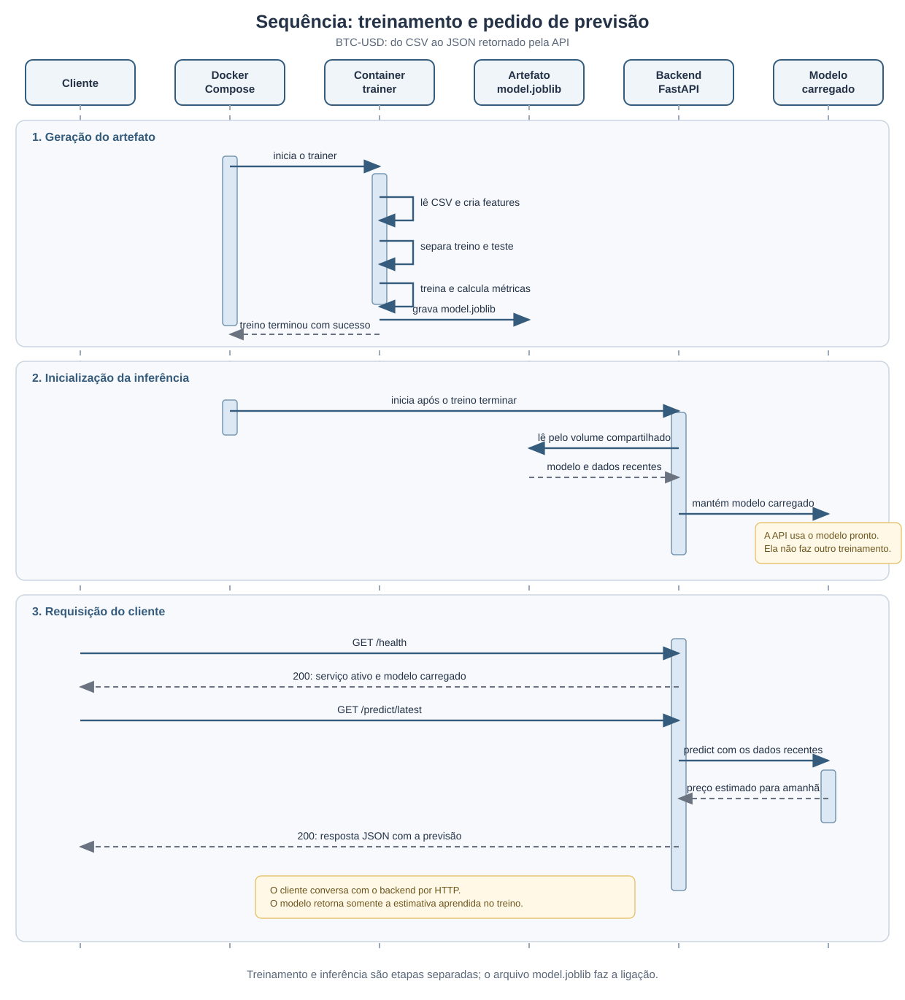
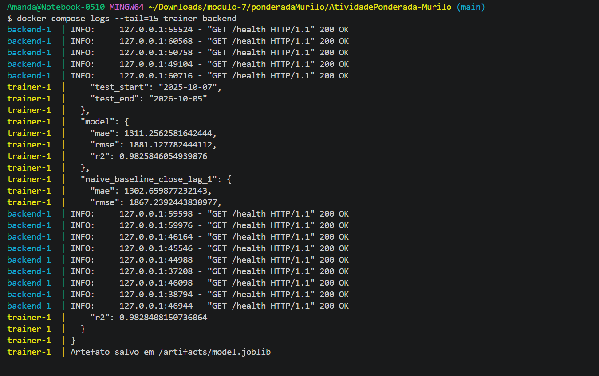
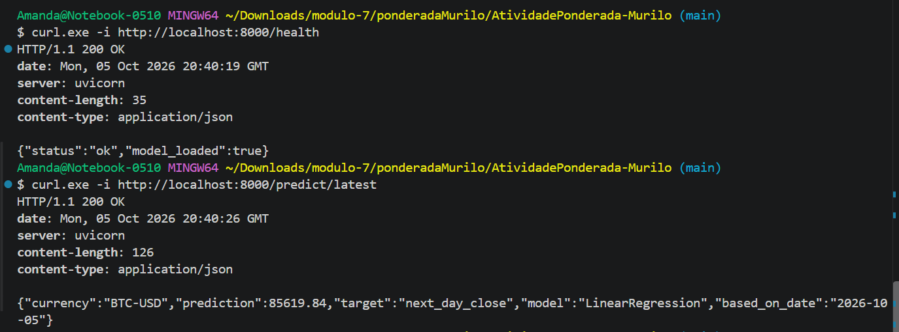
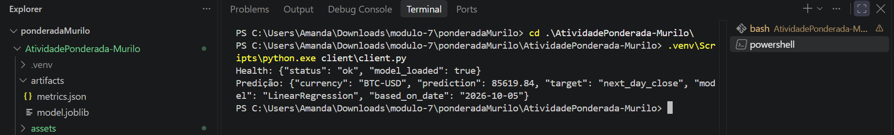

# Atividade Ponderada Murilo: M7 2026

#### Nome: Amanda Cristina Martinez da Rosa

## 1. Objetivo

Aqui eu conto de forma rápida qual era o desafio e o que montei para resolvê-lo. A ideia é acompanhar o modelo desde os dados históricos até uma previsão feita pela API.

Este projeto mostra um fluxo simples de Machine Learning com dados históricos do BTC-USD. Um container treina o modelo e salva um artefato. Um segundo container carrega esse artefato e oferece previsões por uma API Python. A atividade é educacional: o foco está em entender a integração, não em fazer uma previsão financeira confiável.

## 2. Arquitetura e diagrama UML

Aqui está o desenho geral do projeto. Logo abaixo, explico cada parte para ficar fácil seguir o caminho dos dados e do modelo.


**Fonte da imagem**: gerada por IA a partir da descrição da arquitetura e revisada por mim antes de entrar no projeto.

### O que aparece no diagrama

- **BTC-USD diário**: representa os preços históricos do Bitcoin em dólares, organizados por dia. Neste projeto, os dados usados são os preços de fechamento.
- **Arquivo `btc_usd.csv`**: é a cópia local dos dados históricos. O trainer lê esse arquivo para preparar os dados e treinar o modelo, sem precisar consultar a internet durante o treino.
- **Container de treinamento (`trainer`)**: é o ambiente isolado que executa `train.py`. Ele lê o CSV, monta as features, separa treino e teste pela ordem do tempo, treina o modelo e calcula as métricas.
- **Features de preço**: são os valores que entram no modelo. Aqui são os fechamentos dos três dias anteriores e a média dos sete fechamentos anteriores. Usar dias anteriores ajuda a estimar o próximo fechamento sem incluir informação do futuro.
- **Modelo `LinearRegression`**: é o algoritmo de regressão linear que aprende uma relação entre as features históricas e o preço de fechamento do dia seguinte.
- **Artefato `model.joblib`**: é o arquivo produzido pelo treinamento. Ele guarda o modelo ajustado e os dados recentes de que a API precisa para preparar uma previsão. O backend carrega esse arquivo, não treina novamente.
- **Arquivo `metrics.json`**: guarda as métricas calculadas durante o treino, tanto para a regressão linear quanto para o baseline que considera o próximo fechamento igual ao último.
- **Pasta compartilhada `artifacts/`**: é montada nos dois containers. O trainer grava `model.joblib` e `metrics.json` nela. O backend acessa a mesma pasta em modo de leitura. Assim, o artefato passa de um container para o outro sem ser incluído na imagem do backend.
- **Container de inferência (`backend`)**: executa a aplicação FastAPI em Python. Quando inicia, procura e carrega `model.joblib`; depois fica disponível para receber chamadas HTTP.
- **Rota `GET /health`**: permite verificar se a API está ativa e se o modelo foi carregado.
- **Rota `GET /predict/latest`**: usa o modelo carregado e os preços recentes incluídos no artefato para estimar o fechamento do próximo dia.
- **Cliente**: pode ser o script `client/client.py` ou um comando `curl`. Ele chama o backend por HTTP e recebe uma resposta JSON.
- **Docker Compose**: coordena os containers e seus volumes. A configuração espera o trainer terminar com sucesso antes de iniciar o backend.
- **Setas azuis**: mostram o fluxo dos dados e as chamadas HTTP entre cliente e API.
- **Setas laranjas**: mostram a criação e a disponibilização dos artefatos do treinamento para a inferência.

O fluxo completo é: o trainer lê o CSV, cria o modelo e salva os artefatos em `artifacts/`; o Compose espera o treinamento terminar; o backend carrega o mesmo `model.joblib`; por fim, o cliente chama a API e recebe a previsão.

### PlantUML e a imagem

O professor Murilo recomendou descrever o diagrama em detalhe e depois criar a imagem com apoio de IA. Para organizar essa descrição, o Codex sugeriu PlantUML. Com ele, escrevi o diagrama como texto, que fica fácil de revisar e guardar junto com o código. Revisei e aprovei a imagem antes de incluí-la.

A fonte do diagrama arquitetural está em [`docs/architecture.puml`](docs/architecture.puml), e a imagem está em [`assets/architecture.png`](assets/architecture.png).

## 3. Diagrama de sequência

Nesta seção deixei outro desenho, desta vez para mostrar a ordem em que as coisas acontecem. Ele complementa o diagrama de arquitetura: primeiro o Compose inicia o trainer; depois o trainer lê o CSV e salva o modelo; quando o treino termina, o backend carrega o artefato; por fim, o cliente consulta a API e recebe uma previsão.



**Fonte da imagem**: gerada por IA a partir do fluxo descrito em `docs/sequence.puml`.

No desenho, cada coluna representa uma parte do sistema, e as linhas verticais mostram que ela continua participando ao longo do tempo. As setas mostram as mensagens trocadas. A primeira parte mostra o treino e a criação de `model.joblib`. A segunda mostra o backend carregando esse arquivo. A terceira mostra o cliente chamando `/health` e `/predict/latest`, o modelo calculando o resultado e o backend devolvendo JSON.

Eu também fiz esse diagrama como um passo além do que a atividade pedia. O de arquitetura mostra quais partes existem; este mostra em que ordem elas trabalham. A fonte em PlantUML está em [`docs/sequence.puml`](docs/sequence.puml), e a imagem está em [`assets/sequence.svg`](assets/sequence.svg).

## 4. Dados e modelo

Aqui eu explico de onde vieram os dados, o que passei para o modelo e como avaliei o resultado sem embaralhar as datas.

- **Moeda e frequência**: BTC-USD, com observações diárias.
- **Fonte**: Yahoo Finance, acessada com `yfinance`.
- **Período usado nesta execução**: 2021-10-05 a 2026-10-05, com 1.827 observações.
- **Colunas do CSV**: `Date` e `Close`.
- **Features**: fechamentos dos três dias anteriores (`close_lag_1`, `close_lag_2`, `close_lag_3`) e média dos sete fechamentos anteriores (`close_mean_7`).
- **Alvo**: preço de fechamento do próximo dia.
- **Horizonte**: um dia à frente.
- **Algoritmo**: `LinearRegression`.
- **Separação treino e teste**: cronológica, com os primeiros 80% para treino e os 20% finais para teste, sem embaralhar as linhas.
- **Métricas**: MAE, RMSE e R², comparadas com o baseline “o próximo fechamento será igual ao último”.

Um lag é o valor observado em um período anterior. As features usam somente fechamentos anteriores, e o alvo é o próximo fechamento. As primeiras linhas ficam sem histórico completo para criar os lags e a média móvel, então são removidas antes do treino. O corte cronológico deixa o período mais recente para teste e evita misturar o futuro no treino.

O treinamento salva `artifacts/model.joblib` e `artifacts/metrics.json`. Nesta execução, foram usadas 1.456 linhas de treino e 364 de teste. A regressão linear obteve MAE 1311.26, RMSE 1881.13 e R² 0.98258. O baseline obteve MAE 1302.66, RMSE 1867.24 e R² 0.98284. Neste recorte, o baseline ficou ligeiramente melhor. Mantive o modelo simples porque a atividade prioriza demonstrar o fluxo do artefato até a API.

## 5. Deploy e API

Aqui eu mostro como o arquivo treinado chega ao backend e quais endereços o cliente usa para conversar com a API.

O treinamento e a inferência ficam em containers separados. O serviço `trainer` gera o artefato na pasta compartilhada. Depois que ele termina com sucesso, o serviço `backend` inicia e carrega o modelo existente. A API não executa o treinamento.

- **`GET /health`**: informa se o serviço está ativo e se o artefato foi carregado.
- **`GET /predict/latest`**: retorna a estimativa do fechamento do próximo dia usando o modelo carregado.

Esta foi uma resposta observada durante a execução:

```json
{
  "currency": "BTC-USD",
  "prediction": 85619.84,
  "target": "next_day_close",
  "model": "LinearRegression",
  "based_on_date": "2026-10-05"
}
```

## 6. Como reproduzir

Aqui estão os comandos na ordem em que usei para preparar os dados, treinar o modelo, iniciar os containers e consultar a API.

Os comandos desta seção são os que usei no Windows. Para Mac, deixei um passo a passo próprio na seção 7.

### Pré-requisitos

Para repetir o fluxo, tenha Docker Desktop com Docker Compose. Python 3.11 ou mais recente é necessário se você também quiser baixar dados ou treinar fora do container. A internet é necessária para baixar um CSV novo com `yfinance`.

### Baixar os dados

Na pasta do repositório, crie o ambiente Python e baixe os dados:

```bash
python -m venv .venv
.venv/Scripts/python.exe -m pip install -r trainer/requirements.txt
.venv/Scripts/python.exe trainer/download_data.py
```

O script salva o histórico em `data/btc_usd.csv`. O CSV tem 1.827 observações, de 2021-10-05 a 2026-10-05. Depois do download, o treinamento usa o arquivo local.

### Treinar localmente

O treinamento pode ser executado fora do Docker para conferir a geração dos artefatos:

```bash
.venv/Scripts/python.exe trainer/train.py
```

O comando gera `artifacts/model.joblib` e `artifacts/metrics.json`.

### Construir e iniciar os containers

Com o Docker Desktop aberto, construa as imagens e inicie os serviços:

```bash
docker compose build
docker compose up
```

O Compose executa o trainer e, quando o treinamento termina com sucesso, inicia o backend na porta 8000. Para consultar a API, mantenha esse terminal aberto e use outro terminal.

### Health check e previsão

Use `curl` para consultar as duas rotas:

```bash
curl http://localhost:8000/health
curl http://localhost:8000/predict/latest
```

No Windows, use `curl.exe` caso `curl` aponte para o alias do PowerShell.

### Cliente e encerramento

Com os containers ativos, execute o cliente:

```bash
python client/client.py
```

Para encerrar os serviços:

```bash
docker compose down
```

## 7. Instalação e uso no macOS

Incluí este passo a passo porque o professor Murilo usa Mac. Assim, fica mais fácil conferir e rodar o projeto em um ambiente parecido com o dele. Eu não executei estes comandos em um Mac, então eles são instruções de reprodução, não resultados de teste nesta máquina.

### Instalar o Docker Desktop

Baixe o Docker Desktop para Mac pela [página oficial de instalação do Docker](https://docs.docker.com/desktop/setup/install/mac-install/). Escolha o instalador que corresponde ao processador do Mac, Apple silicon ou Intel. Abra o arquivo baixado, arraste o Docker para a pasta Applications e inicie o aplicativo. Na primeira abertura, aceite os termos e espere o Docker indicar que está pronto.

No Terminal, confira se os comandos estão disponíveis:

```bash
docker --version
docker compose version
```

### Rodar o projeto com Docker

Clone o repositório e entre na pasta do projeto:

```bash
git clone https://github.com/AmandaMartinez-R/AtividadePonderada-Murilo.git
cd AtividadePonderada-Murilo
```

O CSV já está incluído no repositório. Com o Docker Desktop aberto, construa as imagens e inicie os serviços:

```bash
docker compose build
docker compose up -d
docker compose ps --all
docker compose logs trainer backend
```

Consulte o serviço e faça uma previsão:

```bash
curl http://localhost:8000/health
curl http://localhost:8000/predict/latest
```

Para usar o cliente Python no Mac, confira a versão instalada e rode:

```bash
python3 --version
python3 client/client.py
```

O cliente usa bibliotecas que já vêm com o Python. Para parar os serviços ao terminar:

```bash
docker compose down
```

### Baixar os dados ou treinar localmente no Mac

Esta parte é opcional, porque o fluxo principal já faz o treinamento no container e o CSV está no projeto. Se quiser baixar dados novos ou executar o trainer fora do Docker, instale Python pelo [guia oficial do Python para macOS](https://docs.python.org/3/using/mac.html) e rode:

```bash
python3 -m venv .venv
source .venv/bin/activate
python -m pip install -r trainer/requirements.txt
python trainer/download_data.py
python trainer/train.py
deactivate
```

O download do CSV precisa de internet. Se usar os dados já salvos no projeto, pode pular o comando `python trainer/download_data.py`.

## Devlog da ponderada

Aqui fui anotando o que fazia enquanto avançava na atividade. Separei o trabalho em etapas para ficar fácil entender o que veio primeiro, quais comandos usei, o que apareceu nos testes e como resolvi os problemas.

### Etapa 1: entender a atividade e desenhar a arquitetura

**1. Entendi o que precisava aparecer.** A atividade pedia dados históricos, treinamento, arquivo do modelo, backend em outro container, operação de previsão, checagem de saúde do serviço e demonstração de uma requisição. Organizei esses itens antes de começar a escrever os outros arquivos.

**2. Desenhei a arquitetura primeiro.** O professor Murilo recomendou descrever o diagrama em detalhe e depois criar a imagem com apoio de IA. O Codex sugeriu PlantUML para guardar o desenho como texto, junto do código. Escrevi a fonte em `docs/architecture.puml` e usei IA para criar a imagem. A primeira prévia SVG não apareceu no chat, então gerei uma versão PNG para conseguir revisar. Depois que aprovei a imagem, ela foi para `assets/architecture.png`.

**3. Fui além do diagrama obrigatório.** Preparei também um diagrama de sequência para mostrar a ordem do treinamento, a geração do artefato, o carregamento no backend e as chamadas do cliente. A imagem ficou em `assets/sequence.svg` e a fonte PlantUML em `docs/sequence.puml`. O desenho de arquitetura mostra quem participa; o de sequência mostra quando cada parte entra no fluxo.

### Etapa 2: preparar os dados

**1. Escolhi a moeda e a fonte.** Usei BTC-USD com frequência diária. Para buscar o histórico, escolhi Yahoo Finance pela biblioteca `yfinance` e salvei uma cópia local em CSV.

**2. Preparei o ambiente.** Criei um ambiente virtual Python e comecei a instalar as dependências. Na primeira tentativa, o Windows bloqueou a conexão de rede com WinError 10013. Depois que a conexão foi liberada, consegui instalar os pacotes e seguir com o download.

Executei:

```bash
.venv/Scripts/python.exe trainer/download_data.py
```

**3. Conferi o arquivo baixado.** O script salvou `data/btc_usd.csv` com as colunas `Date` e `Close`. O CSV ficou com 1.827 observações, de 2021-10-05 a 2026-10-05. A partir daí, o treino usou o arquivo local e não precisou baixar os dados de novo.

### Etapa 3: preparar features e treinar o modelo

**1. Montei as entradas e o valor que queria prever.** Usei três fechamentos anteriores e a média dos últimos sete fechamentos como features. A variável alvo é o fechamento do próximo dia. As primeiras linhas não tinham histórico suficiente para todas as contas, então o código removeu essas linhas antes do treino.

Executei:

```bash
.venv/Scripts/python.exe trainer/train.py
```

**2. Separei passado e futuro.** O código manteve os dados na ordem das datas, sem embaralhar. Usei as primeiras 1.456 linhas para treino e as 364 linhas seguintes para teste. Assim, o teste representa um período posterior ao usado para ajustar o modelo.

**3. Treinei e comparei.** Treinei `LinearRegression`, calculei MAE, RMSE e R², e comparei com uma conta simples: “amanhã será igual a hoje”. Essa comparação ajuda a ver se o modelo acrescentou algo em relação a só repetir o último preço.

A regressão linear obteve MAE 1311.26, RMSE 1881.13 e R² 0.98258. O baseline teve MAE 1302.66, RMSE 1867.24 e R² 0.98284. Nesse conjunto de teste, o baseline ficou um pouco melhor. Não tentei sofisticar o modelo porque a atividade prioriza demonstrar o fluxo entre o modelo, o artefato e o backend.

**4. Conferi o que foi salvo.** O trainer gerou `artifacts/model.joblib` e `artifacts/metrics.json`. Reabri o arquivo com `joblib`, conferi as métricas e fiz uma previsão de verificação usando o modelo salvo. Essa chamada retornou 85619.84.

### Etapa 4: implementar a inferência e testar localmente

**1. Preparei a API e o cliente.** Com apoio do Codex para organizar o código padrão, preparei o backend FastAPI em Python e o script cliente. O backend carrega o modelo ao iniciar e oferece `/health` e `/predict/latest`. O cliente chama as duas rotas e imprime as respostas.

**2. Rodei a API localmente primeiro.** Antes de usar Docker, iniciei o backend com Uvicorn:

```bash
.venv/Scripts/python.exe -m pip install -r backend/requirements.txt
```

Depois executei:

```bash
.venv/Scripts/python.exe -m uvicorn backend.app:app --host 127.0.0.1 --port 8000
```

O log confirmou que o backend carregou `artifacts/model.joblib`. `/health` respondeu HTTP 200 com `{"status":"ok","model_loaded":true}`. `/predict/latest` também respondeu HTTP 200 com a previsão e os metadados. Depois executei `.venv/Scripts/python.exe client/client.py` e confirmei que o cliente consultava as duas rotas. Esse primeiro teste local me ajudou a conferir a API antes de colocar os serviços nos containers.

### Etapa 5: containerizar e compartilhar o artefato

**1. Separei o treino e a API em containers.** Preparei os Dockerfiles e o Docker Compose para executar trainer e backend em containers diferentes. O volume `artifacts/` permite ao trainer escrever o modelo e ao backend ler o mesmo arquivo. O backend espera o trainer terminar com sucesso antes de iniciar.

**2. Encontrei o Docker Desktop.** Na primeira tentativa, o comando `docker` não estava no PATH. Encontrei o Docker Desktop instalado em `LOCALAPPDATA`, abri o aplicativo e usei o CLI pelo caminho da instalação. As versões que apareceram foram Docker 29.7.2 e Docker Compose 5.5.0.

**3. Construí as imagens e fiz uma reconstrução limpa.** Primeiro executei `docker compose build`. Depois rodei:

```bash
docker compose down
docker compose build --no-cache
docker compose up -d
```

O trainer terminou com código 0 e gravou os artefatos. O backend ficou saudável, e os logs confirmaram o carregamento de `/artifacts/model.joblib`. Conferi também os volumes: o trainer lê `data/` e grava em `artifacts/`; o backend lê `artifacts/`. A API ficou disponível na porta 8000.

### Etapa 6: testar a integração ponta a ponta

**1. Conferi se a API estava viva.** Com os containers ativos, consultei `/health`. A chamada retornou HTTP 200 e mostrou `{"status":"ok","model_loaded":true}`.

**2. Pedi uma previsão.** Consultei `/predict/latest`. A chamada retornou HTTP 200 e a resposta foi `{"currency":"BTC-USD","prediction":85619.84,"target":"next_day_close","model":"LinearRegression","based_on_date":"2026-10-05"}`.

**3. Usei o cliente também.** Executei `client.py` contra o backend nos containers. Ele consultou as duas rotas e recebeu as respostas.

**4. Fiz as últimas conferências.** Compilei os arquivos Python e validei a sintaxe YAML do Compose. Deixei o backend rodando no Docker Desktop para a demonstração.

**5. Separei os prints da demonstração.** Guardei três imagens diretamente em `assets/`: `joblib.png` mostra os logs do treino e do backend; `json.png` mostra as respostas HTTP das duas rotas; `client.png` mostra o cliente recebendo as respostas da API. Assim, os prints ficam junto do projeto e cada um ajuda a explicar uma parte do fluxo.

### O que entendi dos Dockerfiles e do Compose

Esta parte registra como interpretei as instruções usadas para montar e iniciar os containers. Nos Dockerfiles, `FROM` escolhe a imagem base com Python 3.11; `WORKDIR` define a pasta de trabalho; `COPY` leva os arquivos necessários para a imagem; `RUN` instala as dependências; `CMD` define o processo que inicia no container; e `EXPOSE` documenta a porta usada pela API. A imagem é o pacote construído; o container é a execução desse pacote.

No Compose, `services` lista trainer e backend; `build` aponta para cada Dockerfile; `ports` publica a porta 8000; e `volumes` compartilha a pasta dos artefatos. `depends_on` com `service_completed_successfully` faz o backend esperar o treinamento terminar sem erro. O `healthcheck` consulta `/health`. O volume permite que um container grave o modelo e o outro carregue o mesmo arquivo.

### Relação com MLOps

Esta atividade mostra partes de um ciclo de operacionalização de Machine Learning, sem ser uma plataforma completa de MLOps. Os dados são mantidos localmente; o treinamento e a inferência têm responsabilidades separadas; as dependências e os ambientes estão definidos; o artefato é persistido; e o modelo é disponibilizado por um serviço.

## 9. Demonstração

Aqui estão os prints que tirei durante a execução. Separei um para os logs dos containers, um para as respostas da API e um para o cliente Python.

### Treinamento e logs do backend

Este print mostra os logs do trainer e do backend. Dá para ver as métricas, a gravação de `model.joblib` e chamadas de saúde chegando ao backend com resposta HTTP 200.



### Respostas da API

Aqui aparecem as chamadas feitas com `curl.exe`: primeiro `/health`, depois `/predict/latest`. As duas retornaram HTTP 200, e a segunda mostra a previsão em JSON.



### Cliente Python

Este print mostra a execução do cliente Python. Ele consulta a saúde do serviço e a previsão, e imprime as duas respostas recebidas.



## 10. Limitações

Aqui ficam os limites que eu levo em conta quando olho para a previsão. Bitcoin muda bastante de preço, e o modelo usa só valores históricos e poucas features. Ele não considera fatores externos. As previsões são experimentais, servem para a atividade e não são recomendação de investimento.

## 11. Estrutura e documentação

Aqui está a árvore de arquivos para encontrar cada parte do projeto e os diagramas.

```text
.
├── README.md
├── docker-compose.yml
├── .dockerignore
├── .gitignore
├── assets/
│   ├── architecture.png
│   ├── client.png
│   ├── joblib.png
│   ├── json.png
│   └── sequence.svg
├── artifacts/
│   ├── metrics.json
│   └── model.joblib
├── backend/
│   ├── Dockerfile
│   ├── app.py
│   └── requirements.txt
├── client/
│   └── client.py
├── data/
│   └── btc_usd.csv
├── docs/
│   ├── architecture.puml
│   └── sequence.puml
└── trainer/
    ├── Dockerfile
    ├── download_data.py
    ├── requirements.txt
    └── train.py
```

- [Fonte do diagrama de arquitetura](docs/architecture.puml)
- [Diagrama de sequência](docs/sequence.puml)
- [Imagem do diagrama](assets/architecture.png)
- [Imagem do diagrama de sequência](assets/sequence.svg)
- [Print dos logs do treino e backend](assets/joblib.png)
- [Print das respostas da API](assets/json.png)
- [Print do cliente Python](assets/client.png)

O diagrama, a estrutura inicial do repositório e trechos padrão de código tiveram apoio do Codex. Os comandos, métricas, respostas e dificuldades descritos neste README correspondem às execuções registradas durante o desenvolvimento.

## 12. Conclusão

Aqui eu fecho contando o que ficou mais claro para mim depois de passar por todas as partes do projeto.

Para mim, a ideia mais importante foi perceber que treinar o modelo é só uma parte do trabalho. Também precisei decidir como guardar o modelo, como fazer outro container encontrar esse arquivo e como deixar uma pessoa pedir uma previsão. Quando vi o cliente receber uma resposta da API, ficou mais fácil ligar o código de treinamento com o serviço que usa o modelo.

Começar pelo diagrama me ajudou a pensar nessa ligação antes de escrever tudo. O diagrama de arquitetura mostra quais peças existem e para que servem. Depois, o diagrama de sequência deixou mais claro o que acontece primeiro e o que depende do término do treinamento. Fiz o segundo desenho como um passo além do pedido, porque achei que ele facilita explicar o fluxo durante a apresentação.

Também gostei de ter mantido o modelo simples. Usei poucos valores históricos e uma regressão linear, então consigo explicar o que entra e o que sai sem complicar a atividade. A comparação mostrou que o baseline, que repete o último preço, ficou um pouco melhor nesse período de teste. Para mim, isso foi um resultado importante de registrar: uma métrica alta sozinha não quer dizer que o modelo seja bom para tomar decisões sobre dinheiro.

O processo teve alguns perrengues reais. A instalação das dependências foi bloqueada pela rede na primeira tentativa, a prévia do diagrama não apareceu e o comando do Docker não estava no PATH. Fui resolvendo cada um e registrando o que aconteceu. Isso também deixou o Devlog mais útil do que se eu anotasse só o resultado final.

No fim, fiquei com um projeto pequeno que consigo explicar por partes: os dados, as features, o treino, o artefato, os containers, a API e o cliente. As instruções para Mac entraram porque o professor Murilo usa esse sistema e podem facilitar a reprodução e a correção. Não testei esses comandos em um Mac, então deixei isso claro no próprio guia. A previsão continua sendo experimental e serve para mostrar a integração, não para orientar investimento.
