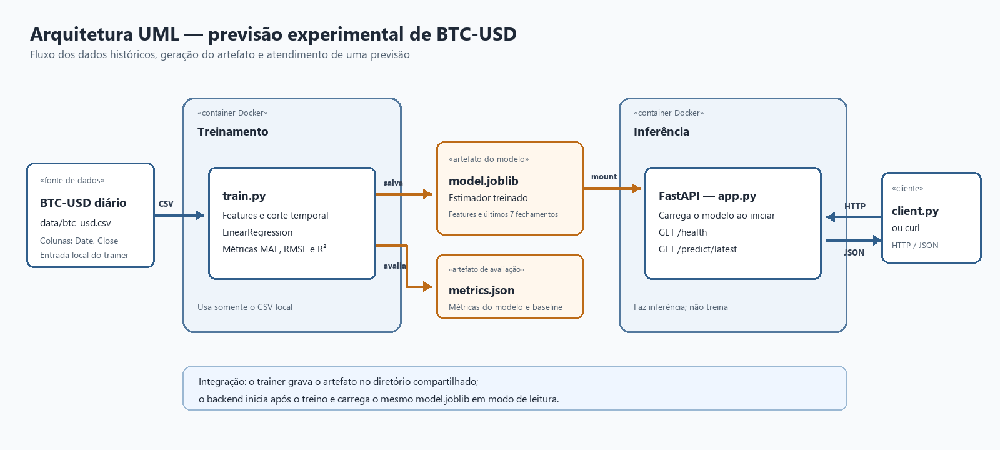

# Atividade Ponderada Murilo: M7 2026

#### Nome: Amanda Cristina Martinez da Rosa

## 1. Objetivo

Esta seção apresenta o desafio e o objetivo da solução. A proposta é acompanhar um modelo desde os dados históricos até uma chamada de previsão feita por uma API.

Este projeto mostra um fluxo simples de Machine Learning com dados históricos do BTC-USD. Um container treina o modelo e salva um artefato. Um segundo container carrega esse artefato e oferece previsões por uma API Python. A atividade é educacional: o foco está em entender a integração, não em fazer uma previsão financeira confiável.

## 2. Arquitetura e diagrama UML

Esta seção apresenta a arquitetura da solução e explica o papel dos elementos que aparecem no desenho.



### O que aparece no diagrama

- **BTC-USD diário**: representa os preços históricos do Bitcoin em dólares, organizados por dia. Neste projeto, os dados usados são os preços de fechamento.
- **Arquivo `btc_usd.csv`**: é a cópia local dos dados históricos. O trainer lê esse arquivo para preparar os dados e treinar o modelo, sem precisar consultar a internet durante o treino.
- **Container de treinamento (`trainer`)**: é o ambiente isolado que executa `train.py`. Ele lê o CSV, monta as features, separa treino e teste pela ordem do tempo, treina o modelo e calcula as métricas.
- **Features de preço**: são os valores que entram no modelo. Aqui são os fechamentos dos três dias anteriores e a média dos sete fechamentos anteriores. Usar dias anteriores ajuda a estimar o próximo fechamento sem incluir informação do futuro.
- **Modelo `LinearRegression`**: é o algoritmo de regressão linear que aprende uma relação entre as features históricas e o preço de fechamento do dia seguinte.
- **Artefato `model.joblib`**: é o arquivo produzido pelo treinamento. Ele guarda o modelo ajustado e os dados recentes de que a API precisa para preparar uma previsão. O backend carrega esse arquivo, não treina novamente.
- **Arquivo `metrics.json`**: guarda as métricas calculadas durante o treino, tanto para a regressão linear quanto para o baseline que considera o próximo fechamento igual ao último.
- **Pasta compartilhada `artifacts/`**: é montada nos dois containers. O trainer grava `model.joblib` e `metrics.json` nela. O backend acessa a mesma pasta em modo de leitura. Assim, o artefato passa de um container para o outro sem ser incluído na imagem do backend.
- **Container de inferência (`backend`)**: executa a aplicação FastAPI em Python. Quando inicia, procura e carrega `model.joblib`; depois fica disponível para receber chamadas HTTP.
- **Rota `GET /health`**: permite verificar se a API está ativa e se o modelo foi carregado.
- **Rota `GET /predict/latest`**: usa o modelo carregado e os preços recentes incluídos no artefato para estimar o fechamento do próximo dia.
- **Cliente**: pode ser o script `client/client.py` ou um comando `curl`. Ele chama o backend por HTTP e recebe uma resposta JSON.
- **Docker Compose**: coordena os containers e seus volumes. A configuração espera o trainer terminar com sucesso antes de iniciar o backend.
- **Setas azuis**: mostram o fluxo dos dados e as chamadas HTTP entre cliente e API.
- **Setas laranjas**: mostram a criação e a disponibilização dos artefatos do treinamento para a inferência.

O fluxo completo é: o trainer lê o CSV, cria o modelo e salva os artefatos em `artifacts/`; o Compose espera o treinamento terminar; o backend carrega o mesmo `model.joblib`; por fim, o cliente chama a API e recebe a previsão.

### PlantUML e a imagem

Esta subseção explica como a fonte textual e a imagem se complementam. O professor Murilo recomendou descrever o diagrama em detalhe e depois criar a imagem com apoio de IA. Para organizar essa descrição, o Codex sugeriu PlantUML. PlantUML permite escrever diagramas como texto, o que facilita revisar e versionar a fonte junto com o projeto. A imagem foi revisada e aprovada antes de ser incluída.

A fonte do diagrama arquitetural está em [`docs/architecture.puml`](docs/architecture.puml), e a imagem está em [`assets/architecture.png`](assets/architecture.png).

### Diagrama de sequência como complemento

Além do diagrama arquitetural pedido, incluí um diagrama de sequência para mostrar a ordem dos acontecimentos. Essa visão complementa a arquitetura: primeiro o Compose inicia o trainer; o trainer lê o CSV, prepara os dados e salva o modelo; após o encerramento bem-sucedido do treino, o backend carrega o artefato; então o cliente consulta `/health` e `/predict/latest`; por fim, a API chama o modelo e devolve a previsão em JSON.

O diagrama está em [`docs/sequence.puml`](docs/sequence.puml). Ele ajuda a explicar tanto como o artefato chega ao serviço quanto como uma requisição passa pelo backend. Essa documentação de sequência é um complemento que fui além do diagrama de arquitetura obrigatório.

## 3. Dados e modelo

Esta seção resume a origem dos dados, as entradas do modelo e como avaliei o resultado respeitando a ordem temporal.

- **Moeda e frequência**: BTC-USD, com observações diárias.
- **Fonte**: Yahoo Finance, acessada com `yfinance`.
- **Período usado nesta execução**: 2021-10-05 a 2026-10-05, com 1.827 observações.
- **Colunas do CSV**: `Date` e `Close`.
- **Features**: fechamentos dos três dias anteriores (`close_lag_1`, `close_lag_2`, `close_lag_3`) e média dos sete fechamentos anteriores (`close_mean_7`).
- **Alvo**: preço de fechamento do próximo dia.
- **Horizonte**: um dia à frente.
- **Algoritmo**: `LinearRegression`.
- **Separação treino e teste**: cronológica, com os primeiros 80% para treino e os 20% finais para teste, sem embaralhar as linhas.
- **Métricas**: MAE, RMSE e R², comparadas com o baseline “o próximo fechamento será igual ao último”.

Um lag é o valor observado em um período anterior. As features usam somente fechamentos anteriores, e o alvo é o próximo fechamento. As primeiras linhas ficam sem histórico completo para criar os lags e a média móvel, então são removidas antes do treino. O corte cronológico deixa o período mais recente para teste e evita misturar o futuro no treino.

O treinamento salva `artifacts/model.joblib` e `artifacts/metrics.json`. Nesta execução, foram usadas 1.456 linhas de treino e 364 de teste. A regressão linear obteve MAE 1311.26, RMSE 1881.13 e R² 0.98258. O baseline obteve MAE 1302.66, RMSE 1867.24 e R² 0.98284. Neste recorte, o baseline ficou ligeiramente melhor. Mantive o modelo simples porque a atividade prioriza demonstrar o fluxo do artefato até a API.

## 4. Deploy e API

Esta seção explica como o artefato treinado chega ao backend e quais rotas o cliente pode consultar.

O treinamento e a inferência ficam em containers separados. O serviço `trainer` gera o artefato na pasta compartilhada. Depois que ele termina com sucesso, o serviço `backend` inicia e carrega o modelo existente. A API não executa o treinamento.

- **`GET /health`**: informa se o serviço está ativo e se o artefato foi carregado.
- **`GET /predict/latest`**: retorna a estimativa do fechamento do próximo dia usando o modelo carregado.

Esta foi uma resposta observada durante a execução:

```json
{
  "currency": "BTC-USD",
  "prediction": 85619.84,
  "target": "next_day_close",
  "model": "LinearRegression",
  "based_on_date": "2026-10-05"
}
```

## 5. Como reproduzir

Esta seção apresenta os comandos na ordem para preparar os dados, treinar o modelo, iniciar os containers e consultar a API.

### Pré-requisitos

Antes de começar, é necessário ter Docker Desktop com Docker Compose. Python 3.11 ou mais recente é necessário para baixar os dados e executar os scripts localmente. A conexão com a internet é necessária para baixar o CSV com `yfinance`.

### Baixar os dados

Na pasta do repositório, crie o ambiente Python e baixe os dados:

```bash
python -m venv .venv
.venv/Scripts/python.exe -m pip install -r trainer/requirements.txt
.venv/Scripts/python.exe trainer/download_data.py
```

O script salva o histórico em `data/btc_usd.csv`. O CSV tem 1.827 observações, de 2021-10-05 a 2026-10-05. Depois do download, o treinamento usa o arquivo local.

### Treinar localmente

O treinamento pode ser executado fora do Docker para conferir a geração dos artefatos:

```bash
.venv/Scripts/python.exe trainer/train.py
```

O comando gera `artifacts/model.joblib` e `artifacts/metrics.json`.

### Construir e iniciar os containers

Com o Docker Desktop aberto, construa as imagens e inicie os serviços:

```bash
docker compose build
docker compose up
```

O Compose executa o trainer e, quando o treinamento termina com sucesso, inicia o backend na porta 8000. Para consultar a API, mantenha esse terminal aberto e use outro terminal.

### Health check e previsão

Use `curl` para consultar as duas rotas:

```bash
curl http://localhost:8000/health
curl http://localhost:8000/predict/latest
```

No Windows, use `curl.exe` caso `curl` aponte para o alias do PowerShell.

### Cliente e encerramento

Com os containers ativos, execute o cliente:

```bash
python client/client.py
```

Para encerrar os serviços:

```bash
docker compose down
```

## 6. Registro do desenvolvimento

Esta seção conta o processo em ordem cronológica. Registrei as decisões, os comandos e os resultados observados, além das dificuldades que realmente apareceram e de como foram resolvidas.

### Etapa 1: entender a atividade e desenhar a arquitetura

Comecei organizando o fluxo antes de implementar o modelo. A atividade pedia dados históricos, treinamento, artefato, backend em outro container, uma operação de previsão, uma forma de verificar o serviço e uma demonstração da integração. Por isso, desenhei primeiro os componentes e o caminho do arquivo treinado até o backend.

O professor Murilo recomendou descrever o diagrama em detalhe e depois criar a imagem com apoio de IA. O Codex sugeriu PlantUML para manter a fonte como texto, o que facilita revisar e versionar o desenho. A primeira prévia SVG não apareceu no chat. Para que fosse possível revisar a imagem, preparei uma versão PNG. Depois da aprovação, coloquei a imagem em `assets/architecture.png` e mantive os arquivos fonte em `docs/`.

Também preparei o diagrama de sequência como um complemento. Ele apresenta em ordem o treinamento, a geração do artefato, o carregamento no backend e a comunicação com o cliente. Assim, o diagrama de arquitetura explica os componentes e o de sequência explica quando cada parte atua.

### Etapa 2: preparar os dados

Escolhi BTC-USD diário e a fonte Yahoo Finance por meio de `yfinance`. Criei um ambiente virtual Python e instalei as dependências necessárias. Na primeira tentativa de instalação, o Windows bloqueou a conexão de rede com WinError 10013. Depois que a conexão foi liberada, a instalação e o download funcionaram.

Executei:

```bash
.venv/Scripts/python.exe trainer/download_data.py
```

O script salvou `data/btc_usd.csv` com as colunas `Date` e `Close`. O arquivo ficou com 1.827 observações, de 2021-10-05 a 2026-10-05. Depois desse download, o treinamento passou a usar o CSV local.

### Etapa 3: preparar features e treinar o modelo

Usei três fechamentos anteriores e a média dos últimos sete fechamentos como features. A variável alvo é o fechamento do próximo dia. O código remove as linhas iniciais que não têm histórico suficiente para calcular todas as features.

Executei:

```bash
.venv/Scripts/python.exe trainer/train.py
```

O código separou os dados em ordem cronológica, sem embaralhamento: 1.456 linhas para treino e 364 para teste. Treinei `LinearRegression`, calculei MAE, RMSE e R², e comparei os resultados com o baseline “amanhã será igual a hoje”.

A regressão linear obteve MAE 1311.26, RMSE 1881.13 e R² 0.98258. O baseline teve MAE 1302.66, RMSE 1867.24 e R² 0.98284. Nesse conjunto de teste, o baseline ficou um pouco melhor. Não tentei sofisticar o modelo porque a atividade prioriza demonstrar o fluxo entre o modelo, o artefato e o backend.

O trainer gerou `artifacts/model.joblib` e `artifacts/metrics.json`. Reabri o arquivo com `joblib`, conferi o JSON das métricas e fiz uma previsão de verificação usando o modelo salvo. Essa chamada retornou 85619.84.

### Etapa 4: implementar a inferência e testar localmente

Com apoio do Codex para estruturar código padrão, preparei o backend FastAPI em Python e o script cliente. O backend carrega o modelo ao iniciar e oferece `/health` e `/predict/latest`. O cliente chama as duas rotas e imprime as respostas.

Antes de usar Docker, executei o backend localmente com Uvicorn:

```bash
.venv/Scripts/python.exe -m uvicorn backend.app:app --host 127.0.0.1 --port 8000
```

O log confirmou que o backend carregou `artifacts/model.joblib`. `/health` respondeu HTTP 200 com `{"status":"ok","model_loaded":true}`. `/predict/latest` também respondeu HTTP 200 com a previsão e os metadados. Executei o cliente localmente e ele consultou as duas rotas.

### Etapa 5: containerizar e compartilhar o artefato

Preparei os Dockerfiles e o Docker Compose para executar trainer e backend em containers separados. O volume `artifacts/` permite ao trainer escrever o modelo e ao backend ler o mesmo arquivo. O backend espera o trainer terminar com sucesso antes de iniciar.

Na primeira tentativa, o comando `docker` não estava no PATH. Encontrei o Docker Desktop instalado em `LOCALAPPDATA`, abri o aplicativo e usei o CLI pelo caminho da instalação. As versões observadas foram Docker 29.7.2 e Docker Compose 5.5.0.

Executei `docker compose build` e as imagens foram construídas. Em seguida, conferi uma reconstrução limpa com:

```bash
docker compose down
docker compose build --no-cache
docker compose up -d
```

O trainer terminou com código 0 e gravou os artefatos. O backend ficou saudável e os logs confirmaram o carregamento de `/artifacts/model.joblib`. Conferi que o trainer lê `data/` e grava em `artifacts/`, enquanto o backend lê `artifacts/`. A porta publicada foi 8000.

### Etapa 6: testar a integração ponta a ponta

Com os containers ativos, consultei `/health` e `/predict/latest`. As duas chamadas retornaram HTTP 200. A previsão observada foi 85619.84, para BTC-USD, com base nos dados até 2026-10-05. Executei também `client.py` contra o backend nos containers, e o cliente recebeu as respostas das duas rotas.

Compilei os arquivos Python e validei a sintaxe YAML do Compose. O backend foi deixado rodando no Docker Desktop para a demonstração.

### O que entendi dos Dockerfiles e do Compose

Esta parte registra como interpretei as instruções usadas para montar e iniciar os containers. Nos Dockerfiles, `FROM` escolhe a imagem base com Python 3.11; `WORKDIR` define a pasta de trabalho; `COPY` leva os arquivos necessários para a imagem; `RUN` instala as dependências; `CMD` define o processo que inicia no container; e `EXPOSE` documenta a porta usada pela API. A imagem é o pacote construído; o container é a execução desse pacote.

No Compose, `services` lista trainer e backend; `build` aponta para cada Dockerfile; `ports` publica a porta 8000; e `volumes` compartilha a pasta dos artefatos. `depends_on` com `service_completed_successfully` faz o backend esperar o treinamento terminar sem erro. O `healthcheck` consulta `/health`. O volume permite que um container grave o modelo e o outro carregue o mesmo arquivo.

### Relação com MLOps

Esta atividade mostra partes de um ciclo de operacionalização de Machine Learning, sem ser uma plataforma completa de MLOps. Os dados são mantidos localmente; o treinamento e a inferência têm responsabilidades separadas; as dependências e os ambientes estão definidos; o artefato é persistido; e o modelo é disponibilizado por um serviço.

## 7. Limitações

Esta seção registra os limites que precisam ser lembrados ao interpretar os resultados. Bitcoin tem alta volatilidade, e o modelo usa somente preços históricos e poucas features. Ele não considera fatores externos. As previsões são experimentais, têm finalidade educacional e não são recomendação de investimento.

## 8. Estrutura e documentação

Esta seção ajuda a localizar os arquivos do projeto e os diagramas que complementam a explicação.

```text
.
├── README.md
├── docker-compose.yml
├── .dockerignore
├── .gitignore
├── assets/
│   └── architecture.png
├── artifacts/
│   ├── metrics.json
│   └── model.joblib
├── backend/
│   ├── Dockerfile
│   ├── app.py
│   └── requirements.txt
├── client/
│   └── client.py
├── data/
│   └── btc_usd.csv
├── docs/
│   ├── architecture.puml
│   └── sequence.puml
└── trainer/
    ├── Dockerfile
    ├── download_data.py
    ├── requirements.txt
    └── train.py
```

- [Fonte do diagrama de arquitetura](docs/architecture.puml)
- [Diagrama de sequência](docs/sequence.puml)
- [Imagem do diagrama](assets/architecture.png)

O diagrama, a estrutura inicial do repositório e trechos padrão de código tiveram apoio do Codex. Os comandos, métricas, respostas e dificuldades descritos neste README correspondem às execuções registradas durante o desenvolvimento.

## 9. Conclusão

Para mim, o ponto mais importante desta ponderada foi perceber que o modelo não termina quando o treinamento acaba. Para ele ser usado, também precisei pensar em como salvar o artefato, disponibilizá-lo para outro container e criar uma forma simples de solicitar uma previsão.

O processo teve alguns obstáculos práticos, como a instalação bloqueada pela rede, a prévia do diagrama que não apareceu e o Docker que não estava no PATH. Resolver essas situações deixou mais claro o caminho entre os componentes. O baseline ter ficado um pouco melhor também foi útil: mostrou que um resultado de regressão alto não deve ser interpretado sozinho nem significa que a previsão seja confiável.

No fim, fiquei com uma solução pequena que consigo explicar por partes: dados, features, treino, artefato, backend, cliente e containers. O diagrama arquitetural mostra quem participa; o diagrama de sequência mostra em que ordem as coisas acontecem. Essa combinação deixou mais fácil entender e apresentar o fluxo da atividade.
